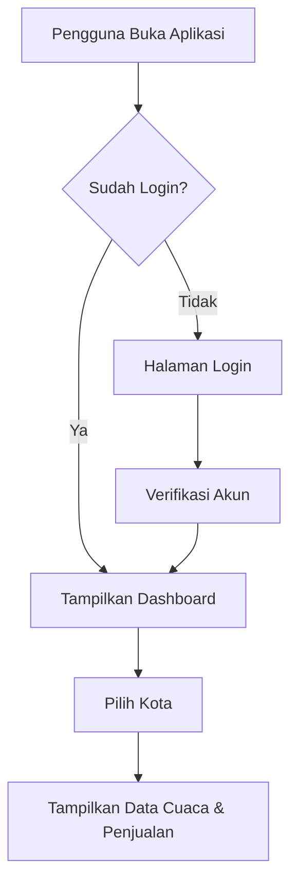
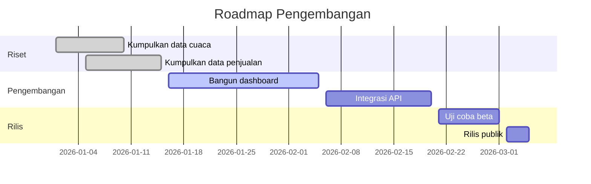

<div align="center">
  
  
  # Halo, Saya Bambang! 👋
  
  **Software Developer | Open Source Enthusiast | Pecinta Kopi**
</div>

# Panduan Standar Sintaks Markdown (Cheat Sheet)

Dokumen ini berisi contoh dummy dari seluruh elemen penanda (_markers_) standar yang paling umum digunakan dalam Markdown. Berkas ini sepenuhnya ditulis dalam format teks biasa (`.md`).

---

## 1. Heading (Judul & Sub-judul)

Heading dibuat menggunakan tanda pagar (`#`) di awal baris. Jumlah tanda pagar menentukan tingkat heading (1 sampai 6).

# Heading Tingkat 1 (#)

## Heading Tingkat 2 (##)

### Heading Tingkat 3 (###)

#### Heading Tingkat 4 (####)

##### Heading Tingkat 5 (#####)

###### Heading Tingkat 6 (######)

---

## 2. Format Teks (Text Styling)

Mengatur gaya teks seperti tebal, miring, coret, atau gabungannya.

- **Teks Tebal**: Menggunakan dua buah tanda bintang (`**`) atau garis bawah (`__`). Contoh: **Teks ini tebal**
- _Teks Miring_: Menggunakan satu buah tanda bintang (`*`) atau garis bawah (`_`). Contoh: _Teks ini miring_
- **_Teks Tebal & Miring_**: Menggabungkan tiga tanda bintang. Contoh: **_Teks ini tebal dan miring_**
- ~~Teks Dicoret~~: Menggunakan dua buah tilde (`~~`). Contoh: ~~Teks ini dicoret~~

---

## 3. Daftar (Lists)

### Daftar Tidak Berurutan (Unordered List)

Menggunakan tanda asterisk (`*`), minus (`-`), atau plus (`+`).

- Item pertama dalam daftar
- Item kedua dalam daftar
  - Sub-item kedua (indentasi)
  - Sub-item ketiga
- Item ketiga dalam daftar

### Daftar Berurutan (Ordered List)

Menggunakan angka diikuti titik (`1.`, `2.`, dst.).

1. Langkah pertama dalam proses
2. Langkah kedua dalam proses
3. Langkah ketiga dalam proses

---

## 4. Tautan & Gambar (Links & Images)

### Tautan (Hyperlink)

Menggunakan format `[Teks Tautan](URL)`.

- Contoh kunjungi website resmi: [Markdown Guide](https://www.markdownguide.org)

### Gambar (Images)

Menggunakan format ``.

- Contoh: ``

---

## 5. Kutipan (Blockquotes)

Menggunakan tanda lebih besar dari (`>`) di awal baris untuk membuat blok kutipan.

> "Markdown adalah alat yang luar biasa bagi penulis, pengembang, dan siapa saja yang ingin mencatat sesuatu dengan cepat tanpa terganggu oleh kerumitan styling."
>
> — Pengembang Markdown

---

## 6. Kode (Code)

### Kode Sebaris (Inline Code)

Menggunakan satu tanda backtick (`` ` ``) di antara teks.

- Contoh: Gunakan perintah `git status` untuk memeriksa status repositori Anda.

### Blok Kode (Code Block)

Menggunakan tiga tanda backtick (```) di awal dan akhir blok, opsional dengan nama bahasa pemrograman untuk syntax highlighting.

```python
# Contoh blok kode Python
def sapa_pengguna(nama):
    pesan = f"Halo, {nama}! Selamat belajar Markdown."
    return pesan

print(sapa_pengguna("Budi"))
```

---

## 7. Tabel (Tables)

Tabel dibuat menggunakan garis vertikal (`|`) dan tanda hubung (`-`) untuk memisahkan baris header.

| No  | Nama Fitur  |  Simbol Marker  | Tingkat Kegunaan |
| :-- | :---------- | :-------------: | ---------------: |
| 1   | Heading     | `#` sd `######` |           Tinggi |
| 2   | Bold/Italic |  `*` atau `_`   |    Sangat Tinggi |
| 3   | List        | `-`, `*`, `1.`  |           Tinggi |
| 4   | Link        |     `[]()`      |           Sedang |

---

## 8. Kotak Centang / Tugas (Task Lists)

Menggunakan tanda kurung siku dengan spasi `[ ]` untuk belum selesai dan `[x]` untuk selesai.

- [x] Memahami apa itu Markdown
- [x] Mengetahui fungsi karakter penanda (marker)
- [ ] Membuat catatan harian menggunakan Markdown
- [ ] Mengonversi berkas `.md` ke HTML/PDF

# 🚀 Proyek Awan Nusantara


Contoh file markdown yang menampilkan berbagai elemen visual: tabel, diagram, alert box, checklist, dan lainnya.

---

## 📋 Deskripsi

Proyek ini adalah dashboard fiktif untuk memantau cuaca dan penjualan kopi di beberapa kota.

> [!NOTE]
> Ini hanya contoh dummy. Semua data di bawah bersifat fiktif untuk keperluan demonstrasi.

> [!WARNING]
> Jangan gunakan data ini untuk keputusan bisnis sungguhan.

> [!TIP]
> Gunakan Obsidian atau GitHub untuk melihat diagram Mermaid di bawah dengan tampilan terbaik.

---

## 🗺️ Alur Sistem



---

## 📊 Perbandingan Kota

| Kota       | Suhu Rata-rata | Penjualan Kopi/Hari | Tren      |
| ---------- | :------------: | :-----------------: | --------- |
| Jakarta    |      31°C      |      1,240 cup      | 📈 Naik   |
| Bandung    |      22°C      |       980 cup       | 📉 Turun  |
| Surabaya   |      33°C      |      1,510 cup      | 📈 Naik   |
| Yogyakarta |      27°C      |       760 cup       | ➖ Stabil |

---

## 📅 Timeline Proyek



---

## ✅ Checklist Fitur

- [x] Autentikasi pengguna
- [x] Tampilan tabel data
- [ ] Grafik interaktif
- [ ] Notifikasi cuaca ekstrem
- [ ] Mode gelap

---

## 🧮 Rumus Perhitungan Indeks Kenyamanan

Indeks kenyamanan dihitung dengan rumus sederhana berikut:

$$
IK = \frac{100 - |T - 25| \times 2}{1 + H/100}
$$

Dengan `T` = suhu (°C) dan `H` = kelembapan (%).

---

## 🧩 Contoh Kode

```python
def hitung_indeks_kenyamanan(suhu, kelembapan):
    dasar = 100 - abs(suhu - 25) * 2
    return dasar / (1 + kelembapan / 100)

print(hitung_indeks_kenyamanan(31, 70))
```

Perubahan pada versi terbaru:

```diff
- suhu_ideal = 25
+ suhu_ideal = 24.5
  kelembapan_maks = 80
```

---

## 🔍 Detail Tambahan (Klik untuk Buka)

<details>
<summary>Lihat catatan pengembang</summary>

Bagian ini disembunyikan secara default dan hanya terbuka saat diklik. Cocok untuk:

- Catatan panjang yang tidak perlu selalu terlihat
- Log perubahan versi lama
- FAQ atau troubleshooting

</details>

---

## 📚 Referensi

Beberapa sumber daya (fiktif) yang digunakan[^1] dalam proyek ini[^2].

[^1]: Data cuaca simulasi, 2026.

[^2]: Data penjualan internal (dummy), tidak untuk dipublikasikan.

---

_Dibuat sebagai contoh demonstrasi elemen visual Markdown._
